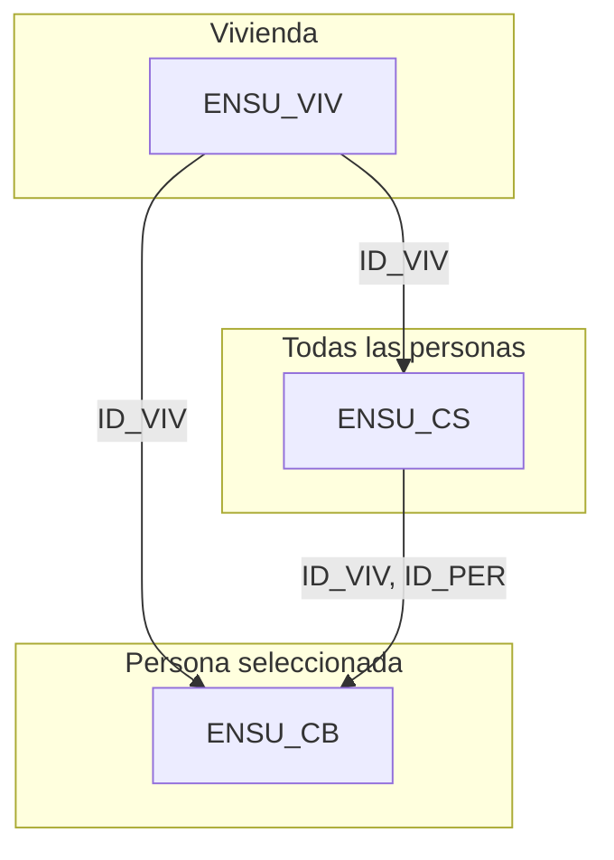

# Encuesta Nacional de Seguridad Pública Urbana (ENSU) – Trimestre I 2024
**README detallado para el análisis de seguridad por estado y género**

## 1. Visión general
La ENSU, levantada por el INEGI, mide la percepción de seguridad, la victimización y la confianza en instituciones de la población de 18 años y más en zonas urbanas de México.  
Para este dashboard usaremos **tres archivos de microdatos** (cuestionario básico, vivienda y sociodemográfico) y sus diccionarios, todos correspondientes al trimestre I 2024 (código “0324”).

## 2. Estructura de archivos
| Carpeta / Archivo | Descripción | Nivel de observación | Tamaño aprox. |
|-------------------|-------------|----------------------|---------------|
| `conjunto_de_datos_ensu_cb_0324.csv` | **Cuestionario básico (CB):** respuestas sobre percepción, victimización, confianza e interacción con autoridades. | Persona seleccionada (`ID_VIV`, `ID_PER`) | ~330 k registros |
| `conjunto_de_datos_ensu_viv_0324.csv` | **Cuestionario de vivienda (VIV):** datos geográficos y de contexto del hogar. | Vivienda (`ID_VIV`) | ~120 k registros |
| `conjunto_de_datos_ensu_cs_0324.csv` | **Cuestionario sociodemográfico (CS):** datos de todas las personas del hogar. | Persona (`ID_VIV`, `ID_PER`) | ~500 k registros |
| `diccionario_de_datos_ensu_*.csv` | Diccionarios de variables y rangos de valores para cada módulo. | n/a | n/a |

## 3. Columnas relevantes por archivo
A continuación se listan **solo las variables necesarias** para el dashboard. Para significados exactos (códigos 1, 2, 9, etc.) consulte cada diccionario.

### 3.1 `ENSU_CB` (Seguridad)
| Variable | Tipo | Significado resumido |
|----------|------|----------------------|
| `ID_VIV` | Clave | Identificador único de la vivienda |
| `ID_PER` | Clave | Identificador de la persona seleccionada |
| **Percepción** |||
| `BP1_1` | Num | Nivel de seguridad percibida en la **ciudad** |
| `BP1_2_01` | Num | Seguridad percibida en **la casa** |
| `BP1_2_02` | Num | Seguridad percibida en **la calle** |
| `BP1_2_03` | Num | Seguridad percibida en **transporte público** |
| **Victimización** |||
| `BP2_1` | Num | ¿Ha sido víctima de delito en últimos 3 meses? |
| `BP2_2_01`–`BP2_2_18` | Num | Tipo(s) específicos de delito sufrido |
| `BP2_3_1` | Num | ¿Denunció el delito? |
| **Confianza institucional** |||
| `BP3_1_01`–`BP3_1_16` | Num | Confianza en instituciones |
| **Interacción con autoridad** |||
| `BP4_1_1`–`BP4_1_3` | Num | Contacto con policía |
| **Factores de expansión** |||
| `FAC_VIV` | Num | Factor vivienda |
| `FAC_SEL` | Num | Factor persona seleccionada |

### 3.2 `ENSU_VIV` (Geografía)
| Variable | Tipo | Significado |
|----------|------|-------------|
| `ID_VIV` | Clave | Identificador de vivienda |
| `NOM_ENT` | Texto | Nombre del **estado** |
| `NOM_MUN` | Texto | Nombre del municipio |
| `NOM_CD` | Texto | Nombre de la ciudad |
| `LOC` | Num | Clave de localidad |
| `CD` | Num | Clave de ciudad |

### 3.3 `ENSU_CS` (Sociodemográfico)
| Variable | Tipo | Significado |
|----------|------|-------------|
| `ID_VIV` | Clave | Identificador de vivienda |
| `ID_PER` | Clave | Identificador de persona |
| `SEXO` | Num | Sexo (1 = Hombre, 2 = Mujer) |
| `EDAD` | Num | Edad en años cumplidos |
| `C_ACT` | Num | Condición de actividad |
| `A_ESC` | Num | Años de escolaridad aprobados |

## 4. Relaciones entre archivos


## 5. Procedimiento de unión en Python (Pandas)
```python
import pandas as pd

# 1. Carga de datos
cb  = pd.read_csv("conjunto_de_datos_ensu_cb_0324.csv", low_memory=False)
viv = pd.read_csv("conjunto_de_datos_ensu_viv_0324.csv", low_memory=False)
cs  = pd.read_csv("conjunto_de_datos_ensu_cs_0324.csv", low_memory=False)

# 2. Sub-selección de columnas
cb_cols  = ["ID_VIV", "ID_PER", "BP1_1", "BP1_2_01", "BP1_2_02", "BP1_2_03", "BP2_1"] + \
           [f"BP2_2_{i:02d}" for i in range(1,19)] + ["BP2_3_1"] + \
           [f"BP3_1_{i:02d}" for i in range(1,17)] + ["BP4_1_1", "BP4_1_2", "BP4_1_3", "FAC_VIV", "FAC_SEL"]

viv_cols = ["ID_VIV", "NOM_ENT", "NOM_MUN", "NOM_CD", "LOC", "CD"]
cs_cols  = ["ID_VIV", "ID_PER", "SEXO", "EDAD", "C_ACT", "A_ESC"]

cb  = cb[cb_cols]
viv = viv[viv_cols]
cs  = cs[cs_cols]

# 3. Merge geográfico
df = cb.merge(viv, on="ID_VIV", how="left")

# 4. Merge sociodemográfico
df = df.merge(cs, on=["ID_VIV", "ID_PER"], how="left")
```

## 6. Ponderación (factores de expansión)
- **`FAC_VIV`**: expande a nivel vivienda.
- **`FAC_SEL`**: expande la persona seleccionada del CB.

## 7. Licencia y fuente
Microdatos públicos provistos por el INEGI (Creative Commons BY 4.0).

---
Contacto: Krishna Sandoval Cambranis  
Última actualización: 23 jun 2025.
